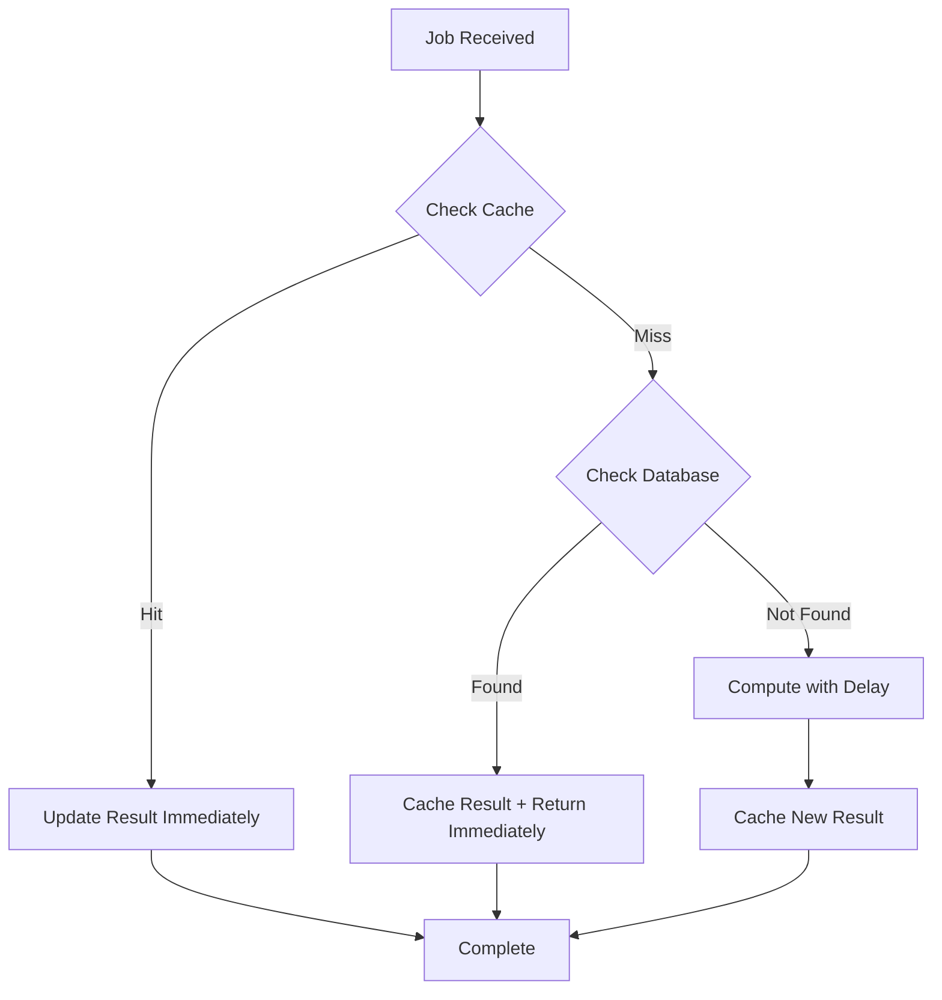

# Computation Deduplication Plan

## Overview

Before computing, the worker will check if an identical result exists (same `a`, `b`, `mode`, `operation`). It checks cache first, then database. If found, it returns immediately without the artificial delay.

## Architecture



## Changes

### 1. Cache Package - Add Result Lookup Functions

**File:** [packages/cache/src/cache.ts](packages/cache/src/cache.ts)

Add a new cache key scheme for operation results keyed by `(a, b, mode, operation)`:

```typescript
const RESULT_PREFIX = 'mathstream:result:';

interface CachedResult {
  result: number | null;
  error: string | null;
}

export async function getCachedResult(
  a: number, b: number, mode: string, operation: string
): Promise<CachedResult | null>

export async function cacheResult(
  a: number, b: number, mode: string, operation: string, 
  result: number | null, error: string | null
): Promise<void>
```

Key format: `mathstream:result:{a}:{b}:{mode}:{operation}`

### 2. Database Package - Add Lookup by Parameters

**File:** [packages/db/src/computations.ts](packages/db/src/computations.ts)

Add a function to find a completed result matching (a, b, mode, operation):

```typescript
export async function findCompletedResult(
  a: number, 
  b: number, 
  mode: ComputationMode, 
  operation: OperationType
): Promise<{ result: number | null; error: string | null } | null>
```

This queries for any computation with:

- Matching `a`, `b`, `mode`
- A result entry for the given `operation` with status `completed` or `failed`

### 3. Worker Processor - Add Deduplication Logic

**File:** [apps/worker/src/processor.ts](apps/worker/src/processor.ts)

Modify `processJob` to check for existing results before computing:

```typescript
export async function processJob(job: Job<JobPayload>): Promise<void> {
  const { computationId, operation, a, b, mode } = job.data;
  
  // 1. Check cache first
  const cachedResult = await getCachedResult(a, b, mode, operation);
  if (cachedResult) {
    await updateResultComplete(computationId, operation, cachedResult.result, cachedResult.error);
    console.log(`Cache hit for ${operation}: ${cachedResult.result ?? cachedResult.error}`);
    return;
  }
  
  // 2. Check database
  const dbResult = await findCompletedResult(a, b, mode, operation);
  if (dbResult) {
    await cacheResult(a, b, mode, operation, dbResult.result, dbResult.error);
    await updateResultComplete(computationId, operation, dbResult.result, dbResult.error);
    console.log(`DB hit for ${operation}: ${dbResult.result ?? dbResult.error}`);
    return;
  }
  
  // 3. No existing result found - compute normally (existing logic)
  // ... existing computation with delay ...
  
  // 4. Cache the new result after computation
  await cacheResult(a, b, mode, operation, result, error);
}
```

### 4. Update Package Exports

**File:** [packages/cache/src/index.ts](packages/cache/src/index.ts) - Already exports all from cache.ts

**File:** [packages/db/src/index.ts](packages/db/src/index.ts) - Already exports all from computations.ts

No changes needed to exports.

## Key Design Decisions

- **Global lookup**: Results are shared across all users (math is deterministic)
- **Per-operation caching**: Each operation result is cached separately for granular reuse
- **Cache TTL**: Uses existing 1-hour TTL for consistency
- **No delay on hit**: Immediately updates result when found, skipping the artificial delay