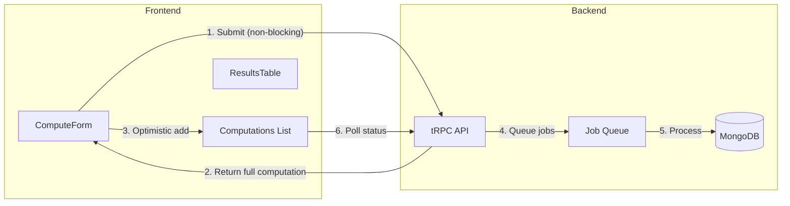

# Continuous Submission Flow

## Current State

- Form blocks during computation (`isLoading = createMutation.isPending || isProcessing`)
- History only updates via 10-second polling
- Single active computation tracked at a time
- Title says "Past Computations"

## Architecture



## Key Changes

### 1. Backend: Return Full Computation on Create

Modify [`apps/web/src/server/routers/computation.ts`](apps/web/src/server/routers/computation.ts) to return the full computation object (not just the ID):

```typescript
// Current: return { id: computationId };
// New: return the full computation object
const computation = await getComputation(computationId);
return computation;
```

### 2. Frontend: Non-Blocking Form

Update [`apps/web/src/components/compute-form.tsx`](apps/web/src/components/compute-form.tsx):

- Remove dependency on `isProcessing` for disabling inputs
- Show brief "Submitting..." state only during mutation
- Clear inputs immediately after successful mutation
- Button text: "Submit" → "Submitting..." → "Submit"

### 3. Frontend: Optimistic List Updates + Auto-Select

Update [`apps/web/src/app/page.tsx`](apps/web/src/app/page.tsx):

- Rename "Past Computations" → "Computations"
- Use tRPC's optimistic updates (`onMutate`, `onSuccess`, `onError`)
- Immediately prepend new computation to list on submit
- **Auto-select newly submitted computation** so Computation Engine shows it immediately
- Track multiple active computation IDs for parallel polling
- Poll all pending/processing computations in the list

### 4. Computation Engine: Always Reflect Selected State

The Computation Engine (ResultsTable) will:

- Always display the currently selected computation from the list
- Show real-time progress updates via polling for the selected item
- Handle initial "pending" state when first submitted (all operations at 0%)

### 5. Frontend: Computation List Item States

Add visual indicators for computation states in the list:

- **Pending/Processing**: Animated spinner indicator
- **Completed**: Normal display
- **Failed**: Error styling

### 6. Multi-Computation Polling

Implement efficient polling for multiple active computations:

- Track set of active IDs needing status updates
- Use `useQueries` or individual queries with polling for each active computation
- Remove from active set when completed/failed

## Files to Modify

- [`apps/web/src/server/routers/computation.ts`](apps/web/src/server/routers/computation.ts) - Return full computation on create
- [`apps/web/src/components/compute-form.tsx`](apps/web/src/components/compute-form.tsx) - Non-blocking submissions
- [`apps/web/src/app/page.tsx`](apps/web/src/app/page.tsx) - Optimistic updates, rename title, multi-polling
- [`apps/web/src/components/results-table.tsx`](apps/web/src/components/results-table.tsx) - Handle pending initial state (minor)