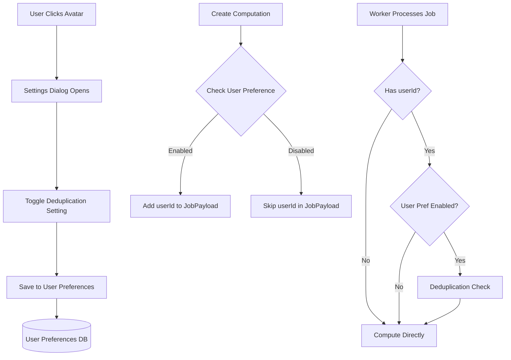

# User-Level Deduplication Configuration Plan

## Overview

Add a user preference to enable/disable computation deduplication. Users can toggle this setting via a settings dialog accessible by clicking their avatar. The worker checks this preference before performing cache/database lookups.

## Architecture Flow



## Changes

### 1. Database Package - User Preferences

**File:** [packages/db/src/users.ts](packages/db/src/users.ts) (new file)

Create functions to manage user preferences:

```typescript
const USERS_COLLECTION = 'users';

export interface UserPreferences {
  enableDeduplication: boolean;
}

export async function getUserPreferences(
  userId: string
): Promise<UserPreferences>

export async function updateUserPreferences(
  userId: string,
  preferences: Partial<UserPreferences>
): Promise<UserPreferences>
```

Default: `enableDeduplication: false` (disabled by default - users must opt-in to enable deduplication)

**File:** [packages/db/src/index.ts](packages/db/src/index.ts)

Export the new user functions.

### 2. Shared Package - Update JobPayload Schema

**File:** [packages/shared/src/schemas.ts](packages/shared/src/schemas.ts)

Add optional `userId` to `JobPayload`:

```typescript
export const JobPayload = z.object({
  computationId: z.string(),
  operation: OperationType,
  a: z.number(),
  b: z.number(),
  mode: ComputationMode,
  userId: z.string().optional(), // Add this
});
```

### 3. Web App - Queue Package Integration

**File:** [packages/queue/src/queue.ts](packages/queue/src/queue.ts)

Update `addComputationJobs` to accept optional `userId`:

```typescript
export async function addComputationJobs(
  computationId: string,
  a: number,
  b: number,
  mode: ComputationMode,
  userId?: string // Add this
): Promise<void>
```

Include `userId` in job data when provided.

### 4. Web App - tRPC Router for User Preferences

**File:** [apps/web/src/server/routers/user.ts](apps/web/src/server/routers/user.ts) (new file)

Create user preferences router:

```typescript
export const userRouter = router({
  getPreferences: protectedProcedure.query(async ({ ctx }) => {
    const userId = ctx.session.user.id;
    return getUserPreferences(userId);
  }),
  
  updatePreferences: protectedProcedure
    .input(z.object({
      enableDeduplication: z.boolean().optional(),
    }))
    .mutation(async ({ input, ctx }) => {
      const userId = ctx.session.user.id;
      return updateUserPreferences(userId, input);
    }),
});
```

**File:** [apps/web/src/server/routers/_app.ts](apps/web/src/server/routers/_app.ts)

Add user router to main router.

### 5. Web App - Update Computation Router

**File:** [apps/web/src/server/routers/computation.ts](apps/web/src/server/routers/computation.ts)

In the `create` mutation:

1. Get user preferences
2. Pass `userId` to `addComputationJobs` only if `enableDeduplication` is true
```typescript
const preferences = await getUserPreferences(userId);
await addComputationJobs(
  computationId, 
  a, 
  b, 
  mode,
  preferences.enableDeduplication ? userId : undefined
);
```


### 6. Web App - UI Components

**File:** [apps/web/src/components/ui/dialog.tsx](apps/web/src/components/ui/dialog.tsx) (new file)

Create Dialog component using Radix UI (shadcn pattern).

**File:** [apps/web/src/components/user-settings-dialog.tsx](apps/web/src/components/user-settings-dialog.tsx) (new file)

Create settings dialog component with:

- Toggle switch for "Enable computation deduplication"
- Description text explaining the feature
- Save/Cancel buttons

**File:** [apps/web/src/components/compute-form.tsx](apps/web/src/components/compute-form.tsx)

Update avatar click handler to open settings dialog:

- Add state for dialog open/close
- Wrap Avatar in button/clickable element
- Render UserSettingsDialog component

### 7. Worker - Conditional Deduplication

**File:** [apps/worker/src/processor.ts](apps/worker/src/processor.ts)

Update `processJob` to check user preference:

```typescript
export async function processJob(job: Job<JobPayload>): Promise<void> {
  const { computationId, operation, a, b, mode, userId } = job.data;
  
  // Only perform deduplication if userId is provided (user has it enabled)
  if (userId) {
    // 1. Check cache first
    const cachedResult = await getCachedResult(a, b, mode, operation);
    if (cachedResult) {
      await updateResultComplete(computationId, operation, cachedResult.result, cachedResult.error);
      return;
    }
    
    // 2. Check database
    const dbResult = await findCompletedResult(a, b, mode, operation);
    if (dbResult) {
      await cacheResult(a, b, mode, operation, dbResult.result, dbResult.error);
      await updateResultComplete(computationId, operation, dbResult.result, dbResult.error);
      return;
    }
  }
  
  // 3. No existing result found or deduplication disabled - compute normally
  // ... rest of computation logic
}
```

## Key Design Decisions

- **Default behavior**: Deduplication is **disabled by default** (opt-in) - users must explicitly enable it via settings
- **User preferences storage**: Stored in MongoDB `users` collection, separate from better-auth's user data
- **Backward compatibility**: `userId` is optional in JobPayload, so existing jobs without it will skip deduplication
- **UI placement**: Settings accessible via avatar click in the compute form header
- **Da