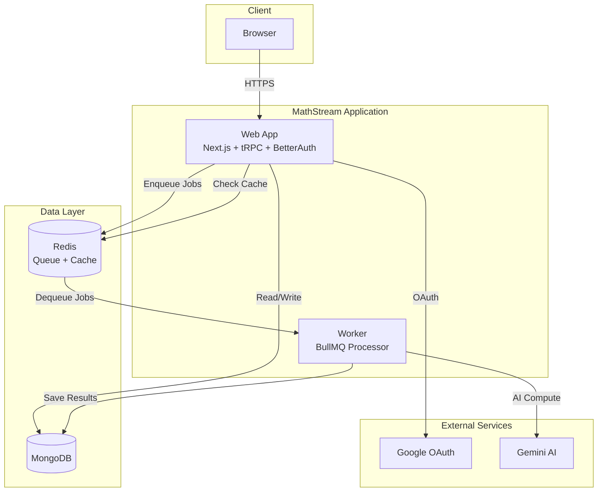
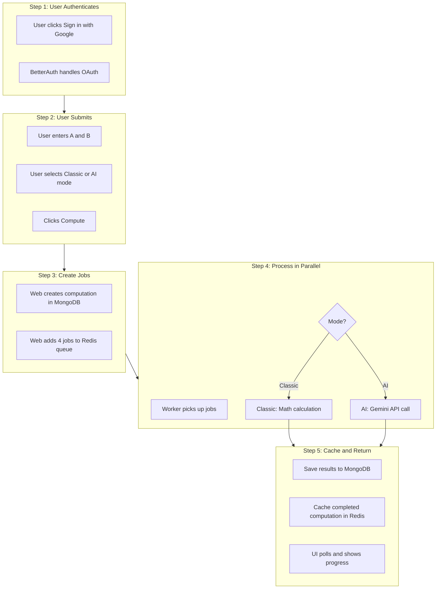
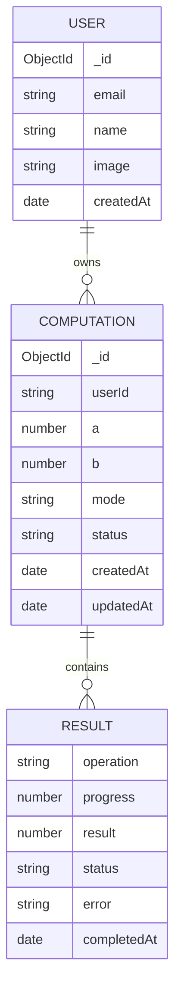
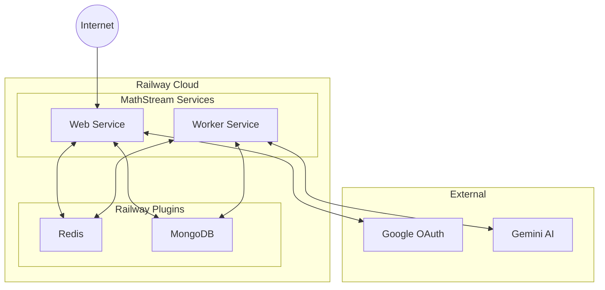

# MathStream - Queue/Worker Computation App

## Important: Commit After Every Step

**INSTRUCTION FOR AGENTS**: After completing each step, you MUST commit your changes before starting the next step. Use descriptive commit messages following this pattern:

```bash
git add .
git commit -m "step X.Y: <description>"
```

---

## System Components




## Request Flow - Step by Step




## Data Model




## Tech Stack

| Layer | Technology |

|-------|------------|

| Framework | Next.js 14 (App Router) |

| API | tRPC v11 + Zod |

| Auth | BetterAuth + Google OAuth |

| Database | MongoDB Native Driver + Zod |

| Queue | BullMQ + Redis (concurrency: 4) |

| Cache | Redis (completed computations) |

| AI | AI SDK + Google Gemini |

| Styling | Tailwind CSS + shadcn/ui |

| Monorepo | Turborepo + pnpm |

| Deployment | Railway |

## Key Design Decisions

| Decision | Choice |

|----------|--------|

| Processing | Parallel - all 4 jobs run simultaneously |

| Progress Updates | Randomized intervals for dynamic UI |

| Job Delay | Configurable via `JOB_DELAY_MS` env var |

| Error Handling | Complete with errors - div by zero shows error, others succeed |

| Computation Mode | Toggle between Classic (math) and AI (Gemini) |

| Caching | Redis cache for completed computations only |

| Auth | Google OAuth via BetterAuth |---

## Randomized Progress Updates

Each job progresses independently with random intervals, creating a dynamic UI where each operation shows different progress:

```javascript
Timeline Example (JOB_DELAY_MS=3000):

        0ms     500ms    1000ms   1500ms   2000ms   2500ms   3000ms
Add:    |░░░░░░░|████░░░░|████░░░░|██████░░|██████░░|████████|████████| 
        0%      35%      35%      58%      58%      100%     100%

Sub:    |░░░░░░░|░░░░░░░░|██░░░░░░|██░░░░░░|██████░░|██████░░|████████|
        0%      0%       22%      22%      71%      71%      100%

Mul:    |░░░░░░░|██░░░░░░|████░░░░|██████░░|████████|████████|████████|
        0%      18%      45%      67%      100%     100%     100%

Div:    |░░░░░░░|░░░░░░░░|░░░░░░░░|████░░░░|████░░░░|██████░░|████████|
        0%      0%       0%       41%      41%      82%      100%
```


## UI Results Table

```javascript
┌───────────┬──────────────────────────┬────────┬────────┐
│ Operation │ Progress                 │ Result │ Status │
├───────────┼──────────────────────────┼────────┼────────┤
│ A + B     │ ████████████████████ 100%│   15   │   ✓    │
│ A - B     │ ██████████████░░░░░░  71%│   -    │   ⏳   │
│ A × B     │ ████████░░░░░░░░░░░░  45%│   -    │   ⏳   │
│ A ÷ B     │ ████░░░░░░░░░░░░░░░░  22%│   -    │   ⏳   │
└───────────┴──────────────────────────┴────────┴────────┘

Total Progress: ████████████░░░░░░░░ 60%

Mode: [Classic] | AI ←── Toggle switch
```

---

## Implementation Steps

### Phase 1: Monorepo Foundation

#### Step 1.1: Initialize pnpm workspace and Turborepo

- Create `package.json` with name "mathstream" and workspaces config
- Create `pnpm-workspace.yaml`
- Create `turbo.json`
- Run `pnpm install`
- **COMMIT**: `git commit -m "step 1.1: initialize mathstream pnpm workspace and turborepo"`

#### Step 1.2: Create shared TypeScript configuration

- Create `tsconfig.json` (base config)
- Create `packages/typescript-config/base.json`
- Create `packages/typescript-config/nextjs.json`
- Create `packages/typescript-config/node.json`
- Create `packages/typescript-config/package.json`
- **COMMIT**: `git commit -m "step 1.2: add shared typescript configurations"`

#### Step 1.3: Create local development infrastructure

- Create `docker-compose.yml` (MongoDB + Redis)
- Create `.env.example` with all environment variables
- Create `.gitignore`
- **COMMIT**: `git commit -m "step 1.3: add docker-compose and env config"`

**docker-compose.yml reference:**

```yaml
services:
  mongodb:
    image: mongo:7
    ports:
    - "27017:27017"
    volumes:
    - mongodb_data:/data/db

  redis:
    image: redis:7-alpine
    ports:
    - "6379:6379"

volumes:
  mongodb_data:
```

**.env.example reference:**

```bash
# Database
MONGODB_URL=mongodb://localhost:27017/mathstream
REDIS_URL=redis://localhost:6379

# Worker
JOB_DELAY_MS=3000

# Auth (BetterAuth + Google)
BETTER_AUTH_SECRET=your-secret-key-min-32-chars
BETTER_AUTH_URL=http://localhost:3000
GOOGLE_CLIENT_ID=your-google-client-id
GOOGLE_CLIENT_SECRET=your-google-client-secret

# AI (Gemini)
GOOGLE_GENERATIVE_AI_API_KEY=your-gemini-api-key
```


#### Step 1.4: Create run scripts

- Add root `package.json` scripts for dev, build, start
- Create `scripts/dev.sh` for one-command local setup
- Update turbo.json with proper pipeline
- **COMMIT**: `git commit -m "step 1.4: add run scripts for local development"`

**Root package.json scripts reference:**

```json
{
  "name": "mathstream",
  "scripts": {
    "dev": "turbo dev",
    "build": "turbo build",
    "start": "turbo start",
    "dev:services": "docker-compose up -d",
    "dev:full": "pnpm dev:services && pnpm dev",
    "lint": "turbo lint",
    "clean": "turbo clean"
  }
}
```

**scripts/dev.sh reference:**

```bash
#!/bin/bash
echo "🚀 Starting MathStream local development environment..."

# Start Docker services
docker-compose up -d

# Wait for services to be ready
echo "⏳ Waiting for MongoDB and Redis..."
sleep 3

# Run development servers
pnpm dev
```

---

### Phase 2: Shared Package

#### Step 2.1: Initialize packages/shared

- Create `packages/shared/package.json`
- Create `packages/shared/tsconfig.json`
- Create `packages/shared/src/index.ts`
- **COMMIT**: `git commit -m "step 2.1: initialize packages/shared"`

#### Step 2.2: Create Zod schemas

- Create `packages/shared/src/schemas.ts`
- Define OperationType, StatusType, ComputationMode enums
- Define ResultSchema, ComputationSchema with mode field
- Define CreateComputationInput with mode, JobPayload
- Export all from index.ts
- **COMMIT**: `git commit -m "step 2.2: add zod schemas with computation mode"`

**schemas.ts reference:**

```typescript
import { z } from 'zod';

export const OperationType = z.enum(['add', 'subtract', 'multiply', 'divide']);
export const StatusType = z.enum(['pending', 'processing', 'completed', 'failed']);
export const ComputationMode = z.enum(['classic', 'ai']);

export const ResultSchema = z.object({
  operation: OperationType,
  progress: z.number().min(0).max(100),
  result: z.number().nullable(),
  status: StatusType,
  error: z.string().nullable(),
  completedAt: z.date().nullable(),
});

export const ComputationSchema = z.object({
  _id: z.string(),
  userId: z.string(),
  a: z.number(),
  b: z.number(),
  mode: ComputationMode,
  status: StatusType,
  results: z.array(ResultSchema),
  createdAt: z.date(),
  updatedAt: z.date(),
});

export const CreateComputationInput = z.object({
  a: z.number(),
  b: z.number(),
  mode: ComputationMode,
});

export const JobPayload = z.object({
  computationId: z.string(),
  operation: OperationType,
  a: z.number(),
  b: z.number(),
  mode: ComputationMode,
});

export type OperationType = z.infer<typeof OperationType>;
export type StatusType = z.infer<typeof StatusType>;
export type ComputationMode = z.infer<typeof ComputationMode>;
export type Result = z.infer<typeof ResultSchema>;
export type Computation = z.infer<typeof ComputationSchema>;
export type CreateComputationInput = z.infer<typeof CreateComputationInput>;
export type JobPayload = z.infer<typeof JobPayload>;
```


#### Step 2.3: Create environment config

- Create `packages/shared/src/config.ts`
- Define envSchema with all env vars including auth and AI
- Create getConfig() function
- Export from index.ts
- **COMMIT**: `git commit -m "step 2.3: add environment configuration"`

**config.ts reference:**

```typescript
import { z } from 'zod';

export const envSchema = z.object({
  // Database
  MONGODB_URL: z.string(),
  REDIS_URL: z.string(),
  
  // Worker
  JOB_DELAY_MS: z.coerce.number().min(100).default(3000),
  
  // Auth
  BETTER_AUTH_SECRET: z.string().min(32),
  BETTER_AUTH_URL: z.string().url(),
  GOOGLE_CLIENT_ID: z.string(),
  GOOGLE_CLIENT_SECRET: z.string(),
  
  // AI
  GOOGLE_GENERATIVE_AI_API_KEY: z.string(),
  
  // General
  NODE_ENV: z.enum(['development', 'production']).default('development'),
});

export type Env = z.infer<typeof envSchema>;

export function getConfig(): Env {
  return envSchema.parse(process.env);
}
```

---

### Phase 3: Database Package

#### Step 3.1: Initialize packages/db

- Create `packages/db/package.json`
- Create `packages/db/tsconfig.json`
- Add mongodb dependency
- Create `packages/db/src/index.ts`
- **COMMIT**: `git commit -m "step 3.1: initialize packages/db"`

#### Step 3.2: Create MongoDB client

- Create `packages/db/src/client.ts`
- Implement connectDb() function
- Implement getDb() function
- Export from index.ts
- **COMMIT**: `git commit -m "step 3.2: add mongodb client connection"`

**client.ts reference:**

```typescript
import { MongoClient, Db } from 'mongodb';
import { getConfig } from '@mathstream/shared';

let client: MongoClient | null = null;
let db: Db | null = null;

export async function connectDb(): Promise<Db> {
  if (db) return db;
  
  const { MONGODB_URL } = getConfig();
  client = new MongoClient(MONGODB_URL);
  await client.connect();
  db = client.db();
  
  console.log('Connected to MongoDB');
  return db;
}

export function getDb(): Db {
  if (!db) throw new Error('Database not connected');
  return db;
}

export async function closeDb(): Promise<void> {
  if (client) {
    await client.close();
    client = null;
    db = null;
  }
}
```


#### Step 3.3: Create computation repository

- Create `packages/db/src/computations.ts`
- Implement createComputation() with userId and mode
- Implement getComputation()
- Implement getComputationsByUser()
- Implement updateResultProgress()
- Implement updateResultComplete()
- Export from index.ts
- **COMMIT**: `git commit -m "step 3.3: add computation repository functions"`

**computations.ts reference:**

```typescript
import { ObjectId } from 'mongodb';
import { getDb } from './client';
import { Computation, OperationType, Result, ComputationMode } from '@mathstream/shared';

const COLLECTION = 'computations';

export async function createComputation(
  userId: string,
  a: number,
  b: number,
  mode: ComputationMode
): Promise<string> {
  const db = getDb();
  const now = new Date();
  
  const operations: OperationType[] = ['add', 'subtract', 'multiply', 'divide'];
  const results: Result[] = operations.map(op => ({
    operation: op,
    progress: 0,
    result: null,
    status: 'pending',
    error: null,
    completedAt: null,
  }));
  
  const doc = {
    userId,
    a,
    b,
    mode,
    status: 'pending',
    results,
    createdAt: now,
    updatedAt: now,
  };
  
  const result = await db.collection(COLLECTION).insertOne(doc);
  return result.insertedId.toString();
}

export async function getComputation(id: string): Promise<Computation | null> {
  const db = getDb();
  const doc = await db.collection(COLLECTION).findOne({ _id: new ObjectId(id) });
  if (!doc) return null;
  return { ...doc, _id: doc._id.toString() } as Computation;
}

export async function getComputationsByUser(userId: string): Promise<Computation[]> {
  const db = getDb();
  const docs = await db.collection(COLLECTION)
    .find({ userId })
    .sort({ createdAt: -1 })
    .limit(10)
    .toArray();
  return docs.map(doc => ({ ...doc, _id: doc._id.toString() })) as Computation[];
}

export async function updateResultProgress(
  computationId: string,
  operation: OperationType,
  progress: number
): Promise<void> {
  const db = getDb();
  await db.collection(COLLECTION).updateOne(
    { _id: new ObjectId(computationId) },
    {
      $set: {
        'results.$[elem].progress': progress,
        'results.$[elem].status': 'processing',
        status: 'processing',
        updatedAt: new Date(),
      },
    },
    { arrayFilters: [{ 'elem.operation': operation }] }
  );
}

export async function updateResultComplete(
  computationId: string,
  operation: OperationType,
  result: number | null,
  error: string | null
): Promise<void> {
  const db = getDb();
  
  await db.collection(COLLECTION).updateOne(
    { _id: new ObjectId(computationId) },
    {
      $set: {
        'results.$[elem].progress': 100,
        'results.$[elem].result': result,
        'results.$[elem].error': error,
        'results.$[elem].status': error ? 'failed' : 'completed',
        'results.$[elem].completedAt': new Date(),
        updatedAt: new Date(),
      },
    },
    { arrayFilters: [{ 'elem.operation': operation }] }
  );
  
  // Check if all results are complete
  const computation = await getComputation(computationId);
  if (computation) {
    const allComplete = computation.results.every(
      r => r.status === 'completed' || r.status === 'failed'
    );
    if (allComplete) {
      await db.collection(COLLECTION).updateOne(
        { _id: new ObjectId(computationId) },
        { $set: { status: 'completed', updatedAt: new Date() } }
      );
    }
  }
}
```

---

### Phase 4: Queue Package

#### Step 4.1: Initialize packages/queue

- Create `packages/queue/package.json`
- Create `packages/queue/tsconfig.json`
- Add bullmq and ioredis dependencies
- Create `packages/queue/src/index.ts`
- **COMMIT**: `git commit -m "step 4.1: initialize packages/queue"`

#### Step 4.2: Create BullMQ queue setup

- Create `packages/queue/src/queue.ts`
- Create Redis connection
- Create computationQueue
- Export queue and connection
- **COMMIT**: `git commit -m "step 4.2: add bullmq queue configuration"`

**queue.ts reference:**

```typescript
import { Queue } from 'bullmq';
import IORedis from 'ioredis';
import { getConfig, JobPayload, ComputationMode } from '@mathstream/shared';

let connection: IORedis | null = null;
let queue: Queue<JobPayload> | null = null;

export function getRedisConnection(): IORedis {
  if (!connection) {
    const { REDIS_URL } = getConfig();
    connection = new IORedis(REDIS_URL, { maxRetriesPerRequest: null });
  }
  return connection;
}

export function getComputationQueue(): Queue<JobPayload> {
  if (!queue) {
    queue = new Queue<JobPayload>('mathstream-computations', {
      connection: getRedisConnection(),
    });
  }
  return queue;
}

export async function addComputationJobs(
  computationId: string,
  a: number,
  b: number,
  mode: ComputationMode
): Promise<void> {
  const queue = getComputationQueue();
  const operations = ['add', 'subtract', 'multiply', 'divide'] as const;
  
  const jobs = operations.map(operation => ({
    name: operation,
    data: { computationId, operation, a, b, mode },
  }));
  
  await queue.addBulk(jobs);
}

export async function closeQueue(): Promise<void> {
  if (queue) {
    await queue.close();
    queue = null;
  }
  if (connection) {
    await connection.quit();
    connection = null;
  }
}
```

---

### Phase 5: Cache Package

#### Step 5.1: Initialize packages/cache

- Create `packages/cache/package.json`
- Create `packages/cache/tsconfig.json`
- Add ioredis dependency
- Create `packages/cache/src/index.ts`
- **COMMIT**: `git commit -m "step 5.1: initialize packages/cache"`

#### Step 5.2: Create Redis cache functions

- Create `packages/cache/src/cache.ts`
- Implement getCachedComputation()
- Implement cacheComputation() with TTL
- Implement invalidateCache()
- Export from index.ts
- **COMMIT**: `git commit -m "step 5.2: add redis cache for completed computations"`

**cache.ts reference:**

```typescript
import IORedis from 'ioredis';
import { getConfig, Computation } from '@mathstream/shared';

let redis: IORedis | null = null;

const CACHE_PREFIX = 'mathstream:computation:';
const CACHE_TTL_SECONDS = 3600; // 1 hour

function getRedis(): IORedis {
  if (!redis) {
    const { REDIS_URL } = getConfig();
    redis = new IORedis(REDIS_URL);
  }
  return redis;
}

export async function getCachedComputation(id: string): Promise<Computation | null> {
  const client = getRedis();
  const cached = await client.get(`${CACHE_PREFIX}${id}`);
  
  if (!cached) return null;
  
  const parsed = JSON.parse(cached);
  // Restore date objects
  parsed.createdAt = new Date(parsed.createdAt);
  parsed.updatedAt = new Date(parsed.updatedAt);
  parsed.results = parsed.results.map((r: any) => ({
    ...r,
    completedAt: r.completedAt ? new Date(r.completedAt) : null,
  }));
  
  return parsed as Computation;
}

export async function cacheComputation(computation: Computation): Promise<void> {
  // Only cache completed computations
  if (computation.status !== 'completed') return;
  
  const client = getRedis();
  await client.setex(
    `${CACHE_PREFIX}${computation._id}`,
    CACHE_TTL_SECONDS,
    JSON.stringify(computation)
  );
}

export async function invalidateCache(id: string): Promise<void> {
  const client = getRedis();
  await client.del(`${CACHE_PREFIX}${id}`);
}

export async function closeCache(): Promise<void> {
  if (redis) {
    await redis.quit();
    redis = null;
  }
}
```

---

### Phase 6: Worker Application

#### Step 6.1: Initialize apps/worker

- Create `apps/worker/package.json` with name `@mathstream/worker`
- Create `apps/worker/tsconfig.json`
- Add dependencies on @mathstream/shared, @mathstream/db, @mathstream/queue
- Add ai and @ai-sdk/google dependencies
- **COMMIT**: `git commit -m "step 6.1: initialize apps/worker"`

#### Step 6.2: Create classic calculator

- Create `apps/worker/src/calculators/classic.ts`
- Implement calculate() with all operations
- Handle division by zero
- **COMMIT**: `git commit -m "step 6.2: add classic calculator"`

**classic.ts reference:**

```typescript
import { OperationType } from '@mathstream/shared';

export function calculateClassic(
  operation: OperationType,
  a: number,
  b: number
): { result: number | null; error: string | null } {
  switch (operation) {
    case 'add':
      return { result: a + b, error: null };
    case 'subtract':
      return { result: a - b, error: null };
    case 'multiply':
      return { result: a * b, error: null };
    case 'divide':
      if (b === 0) return { result: null, error: 'Division by zero' };
      return { result: a / b, error: null };
    default:
      return { result: null, error: 'Unknown operation' };
  }
}
```


#### Step 6.3: Create AI calculator with Gemini

- Create `apps/worker/src/calculators/ai.ts`
- Use AI SDK with Google Gemini
- Create prompt for math calculation
- Parse AI response
- Handle errors
- **COMMIT**: `git commit -m "step 6.3: add ai calculator with gemini"`

**ai.ts reference:**

```typescript
import { generateText } from 'ai';
import { google } from '@ai-sdk/google';
import { OperationType } from '@mathstream/shared';

const operationNames: Record<OperationType, string> = {
  add: 'addition',
  subtract: 'subtraction',
  multiply: 'multiplication',
  divide: 'division',
};

export async function calculateAI(
  operation: OperationType,
  a: number,
  b: number
): Promise<{ result: number | null; error: string | null }> {
  try {
    const operationName = operationNames[operation];
    const prompt = `Calculate the ${operationName} of ${a} and ${b}. 
Only respond with the numeric result, nothing else. 
If it's a division by zero, respond with "ERROR: Division by zero".
If the result is a decimal, round to 6 decimal places.`;

    const { text } = await generateText({
      model: google('gemini-1.5-flash'),
      prompt,
    });

    const trimmed = text.trim();
    
    if (trimmed.startsWith('ERROR:')) {
      return { result: null, error: trimmed.replace('ERROR:', '').trim() };
    }

    const result = parseFloat(trimmed);
    if (isNaN(result)) {
      return { result: null, error: `AI returned invalid result: ${trimmed}` };
    }

    return { result, error: null };
  } catch (error) {
    return { 
      result: null, 
      error: `AI calculation failed: ${error instanceof Error ? error.message : 'Unknown error'}` 
    };
  }
}
```


#### Step 6.4: Create job processor

- Create `apps/worker/src/processor.ts`
- Implement generateRandomIntervals()
- Implement processJob() with mode switching
- Use classic or AI calculator based on mode
- **COMMIT**: `git commit -m "step 6.4: add job processor with mode switching"`

**processor.ts reference:**

```typescript
import { Job } from 'bullmq';
import { JobPayload, getConfig } from '@mathstream/shared';
import { updateResultProgress, updateResultComplete } from '@mathstream/db';
import { calculateClassic } from './calculators/classic';
import { calculateAI } from './calculators/ai';

function sleep(ms: number): Promise<void> {
  return new Promise(resolve => setTimeout(resolve, ms));
}

function generateRandomIntervals(totalMs: number, count: number): number[] {
  const points = Array.from({ length: count - 1 }, () => Math.random() * totalMs);
  points.sort((a, b) => a - b);
  
  const intervals: number[] = [];
  let prev = 0;
  for (const point of points) {
    intervals.push(Math.round(point - prev));
    prev = point;
  }
  intervals.push(Math.round(totalMs - prev));
  
  return intervals;
}

function randomJitter(min: number, max: number): number {
  return Math.random() * (max - min) + min;
}

export async function processJob(job: Job<JobPayload>): Promise<void> {
  const { computationId, operation, a, b, mode } = job.data;
  const { JOB_DELAY_MS } = getConfig();
  
  console.log(`Processing ${operation} (${mode} mode) for computation ${computationId}`);
  
  const intervals = generateRandomIntervals(JOB_DELAY_MS, 3);
  let elapsedTime = 0;
  
  for (let i = 0; i < intervals.length; i++) {
    await sleep(intervals[i]);
    elapsedTime += intervals[i];
    
    const baseProgress = (elapsedTime / JOB_DELAY_MS) * 100;
    const progress = Math.min(99, Math.round(baseProgress + randomJitter(-5, 5)));
    
    const isLastStep = i === intervals.length - 1;
    
    if (!isLastStep) {
      await updateResultProgress(computationId, operation, progress);
    } else {
      // Use appropriate calculator based on mode
      const { result, error } = mode === 'ai' 
        ? await calculateAI(operation, a, b)
        : calculateClassic(operation, a, b);
      
      await updateResultComplete(computationId, operation, result, error);
      console.log(`Completed ${operation} (${mode}): ${result ?? error}`);
    }
  }
}
```


#### Step 6.5: Create worker entry point

- Create `apps/worker/src/index.ts`
- Initialize BullMQ Worker with concurrency: 4
- Connect to MongoDB
- Handle graceful shutdown
- **COMMIT**: `git commit -m "step 6.5: add worker entry point"`

**index.ts reference:**

```typescript
import { Worker } from 'bullmq';
import { getRedisConnection } from '@mathstream/queue';
import { connectDb, closeDb } from '@mathstream/db';
import { JobPayload } from '@mathstream/shared';
import { processJob } from './processor';

async function main() {
  await connectDb();
  
  const worker = new Worker<JobPayload>(
    'mathstream-computations',
    processJob,
    {
      connection: getRedisConnection(),
      concurrency: 4,
    }
  );
  
  worker.on('completed', job => {
    console.log(`Job ${job.id} completed`);
  });
  
  worker.on('failed', (job, err) => {
    console.error(`Job ${job?.id} failed:`, err);
  });
  
  console.log('MathStream Worker started, waiting for jobs...');
  
  const shutdown = async () => {
    console.log('Shutting down...');
    await worker.close();
    await closeDb();
    process.exit(0);
  };
  
  process.on('SIGTERM', shutdown);
  process.on('SIGINT', shutdown);
}

main().catch(console.error);
```


#### Step 6.6: Add worker build configuration and Dockerfile

- Add build script to package.json
- Create `apps/worker/Dockerfile`
- **COMMIT**: `git commit -m "step 6.6: add worker dockerfile for railway"`

**Dockerfile reference:**

```dockerfile
FROM node:20-alpine AS base
RUN corepack enable && corepack prepare pnpm@latest --activate

FROM base AS builder
WORKDIR /app
COPY . .
RUN pnpm install --frozen-lockfile
RUN pnpm --filter @mathstream/worker build

FROM base AS runner
WORKDIR /app
ENV NODE_ENV=production

COPY --from=builder /app/node_modules ./node_modules
COPY --from=builder /app/apps/worker/dist ./apps/worker/dist
COPY --from=builder /app/packages ./packages

CMD ["node", "apps/worker/dist/index.js"]
```

---

### Phase 7: Authentication Setup

#### Step 7.1: Initialize BetterAuth in web app

- Add better-auth dependency to apps/web
- Create `apps/web/src/lib/auth.ts` with BetterAuth config
- Configure Google OAuth provider
- Set up MongoDB adapter for sessions
- **COMMIT**: `git commit -m "step 7.1: initialize betterauth with google oauth"`

**auth.ts reference:**

```typescript
import { betterAuth } from 'better-auth';
import { MongoClient } from 'mongodb';
import { mongodbAdapter } from 'better-auth/adapters/mongodb';

const client = new MongoClient(process.env.MONGODB_URL!);

export const auth = betterAuth({
  database: mongodbAdapter(client),
  emailAndPassword: {
    enabled: false,
  },
  socialProviders: {
    google: {
      clientId: process.env.GOOGLE_CLIENT_ID!,
      clientSecret: process.env.GOOGLE_CLIENT_SECRET!,
    },
  },
});
```


#### Step 7.2: Create auth API routes

- Create `apps/web/src/app/api/auth/[...all]/route.ts`
- Wire up BetterAuth handler
- **COMMIT**: `git commit -m "step 7.2: add betterauth api routes"`

**route.ts reference:**

```typescript
import { auth } from '@/lib/auth';
import { toNextJsHandler } from 'better-auth/next-js';

export const { GET, POST } = toNextJsHandler(auth);
```


#### Step 7.3: Create auth client

- Create `apps/web/src/lib/auth-client.ts`
- Set up client-side auth hooks
- Export useSession, signIn, signOut
- **COMMIT**: `git commit -m "step 7.3: add auth client hooks"`

**auth-client.ts reference:**

```typescript
import { createAuthClient } from 'better-auth/react';

export const { useSession, signIn, signOut } = createAuthClient({
  baseURL: process.env.NEXT_PUBLIC_APP_URL || 'http://localhost:3000',
});
```


#### Step 7.4: Create auth middleware

- Create `apps/web/src/middleware.ts`
- Protect /app routes (require authentication)
- Allow public access to / and /api/auth
- **COMMIT**: `git commit -m "step 7.4: add auth middleware for protected routes"`

**middleware.ts reference:**

```typescript
import { NextResponse } from 'next/server';
import type { NextRequest } from 'next/server';

export function middleware(request: NextRequest) {
  const sessionToken = request.cookies.get('better-auth.session_token');
  
  // Protect /app routes
  if (request.nextUrl.pathname.startsWith('/app')) {
    if (!sessionToken) {
      return NextResponse.redirect(new URL('/', request.url));
    }
  }
  
  return NextResponse.next();
}

export const config = {
  matcher: ['/app/:path*'],
};
```

---

### Phase 8: Web Application Setup

#### Step 8.1: Initialize apps/web with Next.js

- Run `pnpm create next-app apps/web` (TypeScript, Tailwind, App Router)
- Update package.json name to `@mathstream/web`
- Add dependencies on @mathstream/shared, @mathstream/db, @mathstream/queue, @mathstream/cache
- **COMMIT**: `git commit -m "step 8.1: initialize next.js app"`

#### Step 8.2: Set up tRPC

- Install @trpc/server, @trpc/client, @trpc/react-query, @tanstack/react-query
- Create `apps/web/src/server/trpc.ts` (tRPC init)
- Create `apps/web/src/server/routers/_app.ts` (root router)
- Create `apps/web/src/trpc/client.ts` (client setup)
- Create `apps/web/src/trpc/provider.tsx` (React Query provider)
- **COMMIT**: `git commit -m "step 8.2: set up trpc with react query"`

#### Step 8.3: Create tRPC API route

- Create `apps/web/src/app/api/trpc/[trpc]/route.ts`
- Wire up tRPC handler
- **COMMIT**: `git commit -m "step 8.3: add trpc api route handler"`

#### Step 8.4: Create computation router with caching

- Create `apps/web/src/server/routers/computation.ts`
- Implement `create` procedure (insert doc with userId and mode, enqueue jobs)
- Implement `getStatus` procedure with Redis cache check
- Implement `getHistory` procedure for user's past computations
- Add to root router
- **COMMIT**: `git commit -m "step 8.4: add computation trpc router with caching"`

**computation.ts reference:**

```typescript
import { z } from 'zod';
import { router, protectedProcedure } from '../trpc';
import { CreateComputationInput } from '@mathstream/shared';
import { createComputation, getComputation, getComputationsByUser } from '@mathstream/db';
import { addComputationJobs } from '@mathstream/queue';
import { getCachedComputation, cacheComputation } from '@mathstream/cache';

export const computationRouter = router({
  create: protectedProcedure
    .input(CreateComputationInput)
    .mutation(async ({ input, ctx }) => {
      const { a, b, mode } = input;
      const userId = ctx.session.user.id;
      
      const computationId = await createComputation(userId, a, b, mode);
      await addComputationJobs(computationId, a, b, mode);
      
      return { id: computationId };
    }),

  getStatus: protectedProcedure
    .input(z.object({ id: z.string() }))
    .query(async ({ input }) => {
      // Check cache first
      const cached = await getCachedComputation(input.id);
      if (cached) {
        return { ...cached, fromCache: true };
      }
      
      // Fetch from database
      const computation = await getComputation(input.id);
      if (!computation) {
        throw new Error('Computation not found');
      }
      
      // Cache if completed
      if (computation.status === 'completed') {
        await cacheComputation(computation);
      }
      
      // Calculate total progress
      const totalProgress = Math.round(
        computation.results.reduce((sum, r) => sum + r.progress, 0) / 4
      );
      
      return { ...computation, totalProgress, fromCache: false };
    }),

  getHistory: protectedProcedure
    .query(async ({ ctx }) => {
      const userId = ctx.session.user.id;
      return getComputationsByUser(userId);
    }),
});
```


#### Step 8.5: Configure Next.js for Railway

- Update `apps/web/next.config.js` with standalone output
- Add outputFileTracingRoot for monorepo
- Create `apps/web/Dockerfile`
- **COMMIT**: `git commit -m "step 8.5: configure next.js for railway deployment"`

**Dockerfile reference:**

```dockerfile
FROM node:20-alpine AS base
RUN corepack enable && corepack prepare pnpm@latest --activate

FROM base AS builder
WORKDIR /app
COPY . .
RUN pnpm install --frozen-lockfile
RUN pnpm --filter @mathstream/web build

FROM base AS runner
WORKDIR /app
ENV NODE_ENV=production

COPY --from=builder /app/apps/web/.next/standalone ./
COPY --from=builder /app/apps/web/.next/static ./apps/web/.next/static
COPY --from=builder /app/apps/web/public ./apps/web/public

EXPOSE 3000
CMD ["node", "apps/web/server.js"]
```

---

### Phase 9: Web UI

#### Step 9.1: Set up shadcn/ui

- Run `pnpm dlx shadcn-ui@latest init` in apps/web
- Add button, input, progress, table, card, switch, badge, avatar components
- **COMMIT**: `git commit -m "step 9.1: set up shadcn/ui components"`

#### Step 9.2: Create landing page with login

- Update `apps/web/src/app/page.tsx`
- Add MathStream branding and hero section
- Add "Sign in with Google" button
- Redirect to /app if already authenticated
- **COMMIT**: `git commit -m "step 9.2: add landing page with google login"`

#### Step 9.3: Create app layout with header

- Create `apps/web/src/app/app/layout.tsx`
- Add MathStream logo in header
- Add user avatar and sign out button
- **COMMIT**: `git commit -m "step 9.3: add authenticated app layout"`

#### Step 9.4: Create ComputeForm component with mode toggle

- Create `apps/web/src/components/compute-form.tsx`
- Add number inputs for A and B
- Add toggle switch for Classic/AI mode
- Add Compute button
- Wire up tRPC mutation
- **COMMIT**: `git commit -m "step 9.4: add compute form with classic/ai toggle"`

#### Step 9.5: Create ResultsTable component

- Create `apps/web/src/components/results-table.tsx`
- Show operation, progress bar, result, status columns
- Add status badges (pending, processing, completed, failed)
- Show "AI" badge when computation used AI mode
- **COMMIT**: `git commit -m "step 9.5: add results table with progress bars"`

#### Step 9.6: Create main app page with polling

- Create `apps/web/src/app/app/page.tsx`
- Add TRPCProvider wrapper
- Display ComputeForm
- Implement polling with refetchInterval
- Show total progress bar
- Stop polling when complete
- Show cache indicator when result is from cache
- **COMMIT**: `git commit -m "step 9.6: add main app page with polling logic"`

#### Step 9.7: Style and polish UI

- Add proper layout and spacing
- Add loading states
- Add error handling display
- Add computation history section
- Make UI responsive
- **COMMIT**: `git commit -m "step 9.7: polish ui styling and add error handling"`

---

### Phase 10: Documentation

#### Step 10.1: Create README with local setup

- Add MathStream project description
- Add tech stack overview
- Add architecture diagrams
- Add local development instructions
- Add environment variables documentation
- Explain design decisions and choices
- **COMMIT**: `git commit -m "step 10.1: add readme with local setup instructions"`

#### Step 10.2: Add Railway deployment guide

- Add Railway deployment steps
- Document environment variable configuration
- Add Google OAuth setup instructions
- Add Gemini API setup instructions
- **COMMIT**: `git commit -m "step 10.2: add railway deployment guide to readme"`

---

## Final Monorepo Structure

```javascript
mathstream/
├── apps/
│   ├── web/
│   │   ├── src/
│   │   │   ├── app/
│   │   │   │   ├── api/
│   │   │   │   │   ├── auth/[...all]/route.ts
│   │   │   │   │   └── trpc/[trpc]/route.ts
│   │   │   │   ├── app/
│   │   │   │   │   ├── layout.tsx
│   │   │   │   │   └── page.tsx
│   │   │   │   ├── page.tsx (landing)
│   │   │   │   └── layout.tsx
│   │   │   ├── components/
│   │   │   │   ├── compute-form.tsx
│   │   │   │   └── results-table.tsx
│   │   │   ├── lib/
│   │   │   │   ├── auth.ts
│   │   │   │   └── auth-client.ts
│   │   │   ├── server/
│   │   │   │   ├── trpc.ts
│   │   │   │   └── routers/
│   │   │   │       ├── _app.ts
│   │   │   │       └── computation.ts
│   │   │   ├── trpc/
│   │   │   │   ├── client.ts
│   │   │   │   └── provider.tsx
│   │   │   └── middleware.ts
│   │   ├── Dockerfile
│   │   ├── next.config.js
│   │   └── package.json
│   └── worker/
│       ├── src/
│       │   ├── calculators/
│       │   │   ├── classic.ts
│       │   │   └── ai.ts
│       │   ├── index.ts
│       │   └── processor.ts
│       ├── Dockerfile
│       └── package.json
├── packages/
│   ├── cache/
│   │   ├── src/
│   │   │   ├── cache.ts
│   │   │   └── index.ts
│   │   └── package.json
│   ├── db/
│   │   ├── src/
│   │   │   ├── client.ts
│   │   │   ├── computations.ts
│   │   │   └── index.ts
│   │   └── package.json
│   ├── queue/
│   │   ├── src/
│   │   │   ├── queue.ts
│   │   │   └── index.ts
│   │   └── package.json
│   ├── shared/
│   │   ├── src/
│   │   │   ├── config.ts
│   │   │   ├── schemas.ts
│   │   │   └── index.ts
│   │   └── package.json
│   └── typescript-config/
│       ├── base.json
│       ├── nextjs.json
│       ├── node.json
│       └── package.json
├── scripts/
│   └── dev.sh
├── docker-compose.yml
├── .env.example
├── .gitignore
├── turbo.json
├── pnpm-workspace.yaml
├── package.json
└── README.md
```


## Railway Deployment




## Railway Deployment Steps

1. Push code to GitHub
2. Create Railway project
3. Add MongoDB plugin
4. Add Redis plugin
5. Add web service pointing to `apps/web/Dockerfile`
6. Add worker service pointing to `apps/worker/Dockerfile`
7. Configure environment variables:

- `MONGODB_URL` (from MongoDB plugin)
- `REDIS_URL` (from Redis plugin)
- `BETTER_AUTH_SECRET` (generate secure random string)
- `BETTER_AUTH_URL` (Railway-provided URL)
- `GOOGLE_CLIENT_ID` (from Google Cloud Console)
- `GOOGLE_CLIENT_SECRET` (from Google Cloud Console)
- `GOOGLE_GENERATIVE_AI_API_KEY` (from Google AI Studio)
- `JOB_DELAY_MS` (default: 3000)